```
## ── Attaching packages ─────────────────────────────────────────────────────── tidyverse 1.3.0 ──
```

```
## ✓ ggplot2 3.3.2     ✓ purrr   0.3.4
## ✓ tibble  3.0.3     ✓ dplyr   1.0.2
## ✓ tidyr   1.1.2     ✓ stringr 1.4.0
## ✓ readr   1.3.1     ✓ forcats 0.5.0
```

```
## ── Conflicts ────────────────────────────────────────────────────────── tidyverse_conflicts() ──
## x dplyr::filter() masks stats::filter()
## x dplyr::lag()    masks stats::lag()
```


# Sobre o banco de dados

O banco de dados foi obtido no site do portal INEP. Baixei os microdados do ENEM referentes ao ano de 2016 e calculei as métricas de nota média das provas feitas para cada município [link](http://portal.inep.gov.br/web/guest/microdados) do estado da Bahia e de Pernambuco.
Os dados originais contém informações sociodemográficas e de desempenho de cada uma das pessoas que fizeram a prova.

CO_MUNICIPIO_RESIDENCIA - Codigo de município de residência
- *uf_res* - Codigo de estado de residencia (26 - Pernambuco, 29 - Bahia)
- *nu_nota_cn* - Nota média do município na prova de ciências naturais
- *nu_nota_ch* - Nota média do município na prova de ciências humanas
- *nu_nota_lc* - Nota média do município na prova de linguagens e códigos
- *nu_nota_mt* - Nota média do município na prova de matemática
- *nu_nota_redação* - Nota média do município na prova de redação


```r
df <- read_csv("data/base.csv")
head(df) %>% 
  kable()
```


| X1| CO_MUNICIPIO_RESIDENCIA| uf_res| nu_nota_cn| nu_nota_ch| nu_nota_lc| nu_nota_mt| nu_nota_redacao|
|--:|-----------------------:|------:|----------:|----------:|----------:|----------:|---------------:|
|  1|                 2600054|     26|   468.2704|   524.8531|   513.9045|   469.7241|        509.8615|
|  2|                 2600104|     26|   473.2072|   522.2539|   516.6829|   483.7351|        515.9032|
|  3|                 2600203|     26|   454.7730|   496.4057|   485.9403|   453.0824|        495.7622|
|  4|                 2600302|     26|   454.9958|   516.3785|   501.3391|   458.7522|        510.3732|
|  5|                 2600401|     26|   449.6662|   499.8627|   494.8095|   450.7092|        482.6797|
|  6|                 2600500|     26|   456.1814|   508.0582|   500.8154|   460.2662|        489.9111|

# Perguntas

As perguntas a serem respondidas eram:

- Existem municípios com desempenhos parecidos na Bahia? (Análise de agrupamento)
- Existe diferença no desempenho médio dos municípios da Bahia em relação ao municípios de Pernambuco? (Análise discriminante)

# 1. Análise de agrupamento


## Pacotes necessários


```r
library(ggplot2)
library(factoextra)
library(GGally)
library(gridExtra)
```

## Descritiva

Veja na figura abaixo que as variáveis de nota estão altamente correlacionadas, ou seja, os municípios tendem a ter desempenho semelhante em todas as materias.  Um indicador de que não existem municípios com desemepnho alto em matemática e péssimo em redação (por exemplo.). 

Além disso, a característica da métrica ser uma média de uma variável contínua fez com que ela tivesse tendência de comportamento simétrico.

```r
df_bahia <- df %>% filter(uf_res == 29)
ggpairs(df_bahia[,-c(1:3)],  aes(alpha=0.75), lower=list(continuous="smooth")) + theme_minimal()
```

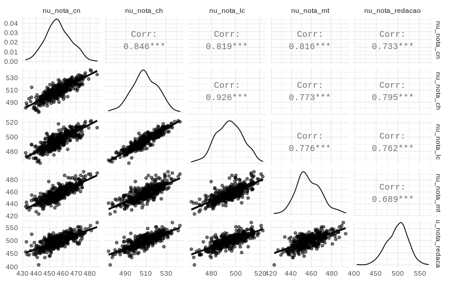<!-- -->

## Agrupamento Hierárquico {.tabset}

Os métodos hierárquicos da análise de cluster tem como principal característica um algoritmo capaz de fornecer mais de um tipo de partição dos dados. Ele gera vários agrupamentos possíveis, onde um cluster pode ser mesclado a outro em determinado passo do algoritmo.
Esses métodos não exigem que já se tenha um número inicial de clusters e são considerados inflexíveis uma vez que não se pode trocar um elemento de grupo. Pra rodar o método é necessário setar uma métrica de distância e um critério de linkage.

O metódo não hierárquico foi utilizado para identificarmos descritivamente o número de clusters necessários para agrupar os municípios da Bahia.

### Single 

O critério de linkage single agrupa os clusters de acordo com a *menor* distância entre todos os pares.


```r
library(NbClust)
clust <- NbClust(data = df_bahia[,-c(1:3)], method= "single", index = "all")
```

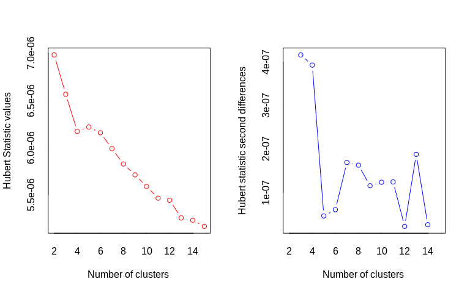<!-- -->

```
*** : The Hubert index is a graphical method of determining the number of clusters.
                In the plot of Hubert index, we seek a significant knee that corresponds to a 
                significant increase of the value of the measure i.e the significant peak in Hubert
                index second differences plot. 
 
```

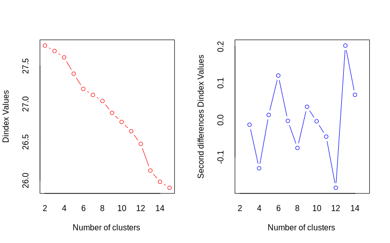<!-- -->

```
*** : The D index is a graphical method of determining the number of clusters. 
                In the plot of D index, we seek a significant knee (the significant peak in Dindex
                second differences plot) that corresponds to a significant increase of the value of
                the measure. 
 
******************************************************************* 
* Among all indices:                                                
* 10 proposed 2 as the best number of clusters 
* 2 proposed 3 as the best number of clusters 
* 2 proposed 4 as the best number of clusters 
* 1 proposed 6 as the best number of clusters 
* 1 proposed 7 as the best number of clusters 
* 1 proposed 11 as the best number of clusters 
* 1 proposed 12 as the best number of clusters 
* 4 proposed 13 as the best number of clusters 
* 1 proposed 14 as the best number of clusters 
* 1 proposed 15 as the best number of clusters 

                   ***** Conclusion *****                            
 
* According to the majority rule, the best number of clusters is  2 
 
 
******************************************************************* 
```


```r
fviz_nbclust(clust)
```

```
Among all indices: 
===================
* 2 proposed  0 as the best number of clusters
* 10 proposed  2 as the best number of clusters
* 2 proposed  3 as the best number of clusters
* 2 proposed  4 as the best number of clusters
* 1 proposed  6 as the best number of clusters
* 1 proposed  7 as the best number of clusters
* 1 proposed  11 as the best number of clusters
* 1 proposed  12 as the best number of clusters
* 4 proposed  13 as the best number of clusters
* 1 proposed  14 as the best number of clusters
* 1 proposed  15 as the best number of clusters

Conclusion
=========================
* According to the majority rule, the best number of clusters is  2 .
```

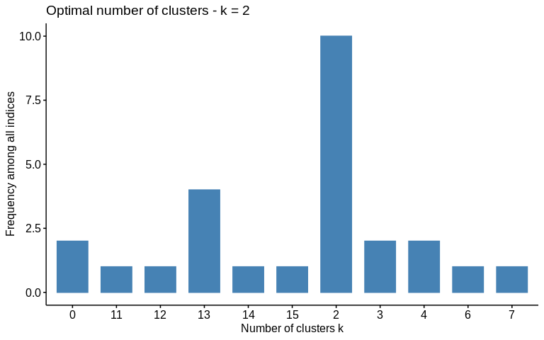<!-- -->

 
### Complete

O critério de linkage complete agrupa os clusters de acordo com a *maior* distância entre todos os pares.


```r
clust <- NbClust(data = df_bahia[,-c(1:3)], method= "complete", index = "all")
```

<!-- -->

```
*** : The Hubert index is a graphical method of determining the number of clusters.
                In the plot of Hubert index, we seek a significant knee that corresponds to a 
                significant increase of the value of the measure i.e the significant peak in Hubert
                index second differences plot. 
 
```

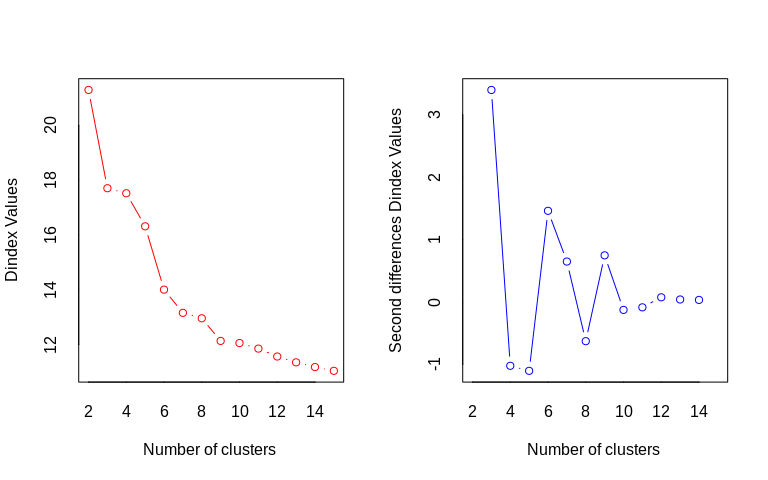<!-- -->

```
*** : The D index is a graphical method of determining the number of clusters. 
                In the plot of D index, we seek a significant knee (the significant peak in Dindex
                second differences plot) that corresponds to a significant increase of the value of
                the measure. 
 
******************************************************************* 
* Among all indices:                                                
* 4 proposed 2 as the best number of clusters 
* 12 proposed 3 as the best number of clusters 
* 3 proposed 4 as the best number of clusters 
* 1 proposed 5 as the best number of clusters 
* 1 proposed 10 as the best number of clusters 
* 2 proposed 15 as the best number of clusters 

                   ***** Conclusion *****                            
 
* According to the majority rule, the best number of clusters is  3 
 
 
******************************************************************* 
```


```r
fviz_nbclust(clust)
```

```
Among all indices: 
===================
* 2 proposed  0 as the best number of clusters
* 1 proposed  1 as the best number of clusters
* 4 proposed  2 as the best number of clusters
* 12 proposed  3 as the best number of clusters
* 3 proposed  4 as the best number of clusters
* 1 proposed  5 as the best number of clusters
* 1 proposed  10 as the best number of clusters
* 2 proposed  15 as the best number of clusters

Conclusion
=========================
* According to the majority rule, the best number of clusters is  3 .
```

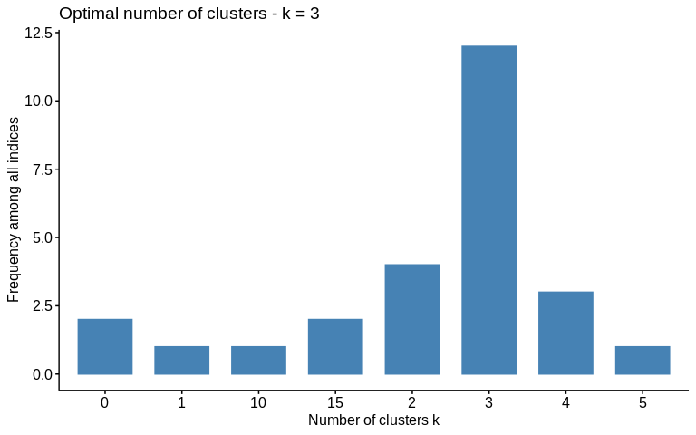<!-- -->

### Average
O critério de linkage average agrupa os clusters de acordo com a *média* distância entre todos os pares.


```r
clust <- NbClust(data = df_bahia[,-c(1:3)], method= "average", index = "all")
```

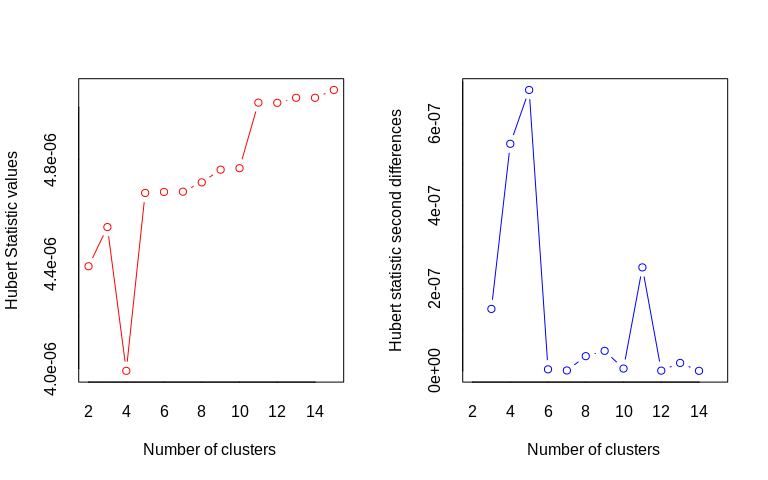<!-- -->

```
*** : The Hubert index is a graphical method of determining the number of clusters.
                In the plot of Hubert index, we seek a significant knee that corresponds to a 
                significant increase of the value of the measure i.e the significant peak in Hubert
                index second differences plot. 
 
```

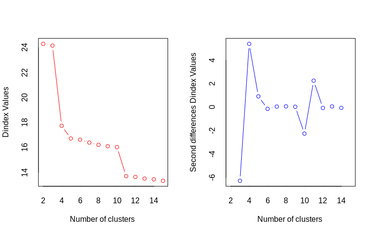<!-- -->

```
*** : The D index is a graphical method of determining the number of clusters. 
                In the plot of D index, we seek a significant knee (the significant peak in Dindex
                second differences plot) that corresponds to a significant increase of the value of
                the measure. 
 
******************************************************************* 
* Among all indices:                                                
* 6 proposed 2 as the best number of clusters 
* 4 proposed 3 as the best number of clusters 
* 8 proposed 4 as the best number of clusters 
* 1 proposed 5 as the best number of clusters 
* 4 proposed 11 as the best number of clusters 
* 1 proposed 15 as the best number of clusters 

                   ***** Conclusion *****                            
 
* According to the majority rule, the best number of clusters is  4 
 
 
******************************************************************* 
```


```r
fviz_nbclust(clust)
```

```
Among all indices: 
===================
* 2 proposed  0 as the best number of clusters
* 6 proposed  2 as the best number of clusters
* 4 proposed  3 as the best number of clusters
* 8 proposed  4 as the best number of clusters
* 1 proposed  5 as the best number of clusters
* 4 proposed  11 as the best number of clusters
* 1 proposed  15 as the best number of clusters

Conclusion
=========================
* According to the majority rule, the best number of clusters is  4 .
```

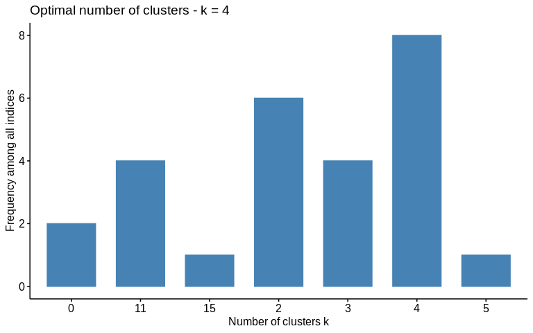<!-- -->

### Centroide
O critério de linkage centroide agrupa os clusters de acordo com a distância média de todos os pares ao *centroide* do grupo.


```r
clust <- NbClust(data = df_bahia[,-c(1:3)], method= "centroid", index = "all")
```

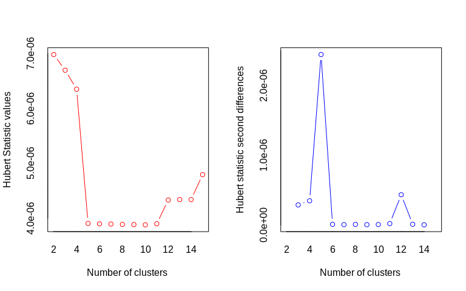<!-- -->

```
*** : The Hubert index is a graphical method of determining the number of clusters.
                In the plot of Hubert index, we seek a significant knee that corresponds to a 
                significant increase of the value of the measure i.e the significant peak in Hubert
                index second differences plot. 
 
```

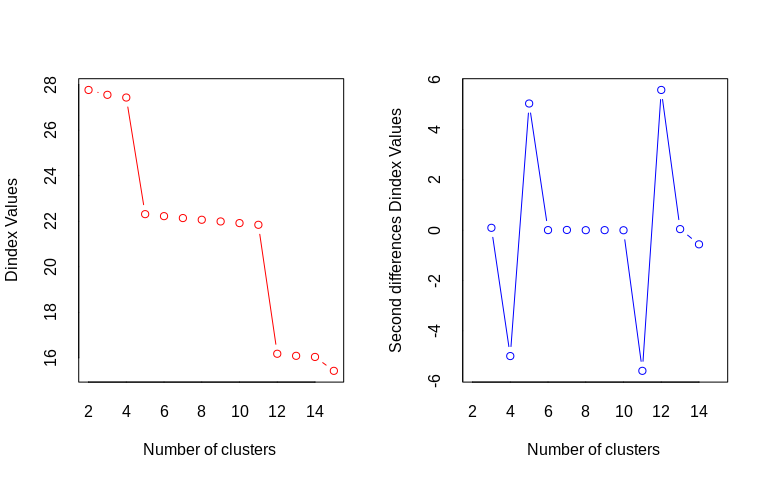<!-- -->

```
*** : The D index is a graphical method of determining the number of clusters. 
                In the plot of D index, we seek a significant knee (the significant peak in Dindex
                second differences plot) that corresponds to a significant increase of the value of
                the measure. 
 
******************************************************************* 
* Among all indices:                                                
* 9 proposed 2 as the best number of clusters 
* 2 proposed 3 as the best number of clusters 
* 3 proposed 5 as the best number of clusters 
* 1 proposed 9 as the best number of clusters 
* 1 proposed 11 as the best number of clusters 
* 6 proposed 12 as the best number of clusters 
* 1 proposed 14 as the best number of clusters 
* 1 proposed 15 as the best number of clusters 

                   ***** Conclusion *****                            
 
* According to the majority rule, the best number of clusters is  2 
 
 
******************************************************************* 
```


```r
fviz_nbclust(clust)
```

```
Among all indices: 
===================
* 2 proposed  0 as the best number of clusters
* 9 proposed  2 as the best number of clusters
* 2 proposed  3 as the best number of clusters
* 3 proposed  5 as the best number of clusters
* 1 proposed  9 as the best number of clusters
* 1 proposed  11 as the best number of clusters
* 6 proposed  12 as the best number of clusters
* 1 proposed  14 as the best number of clusters
* 1 proposed  15 as the best number of clusters

Conclusion
=========================
* According to the majority rule, the best number of clusters is  2 .
```

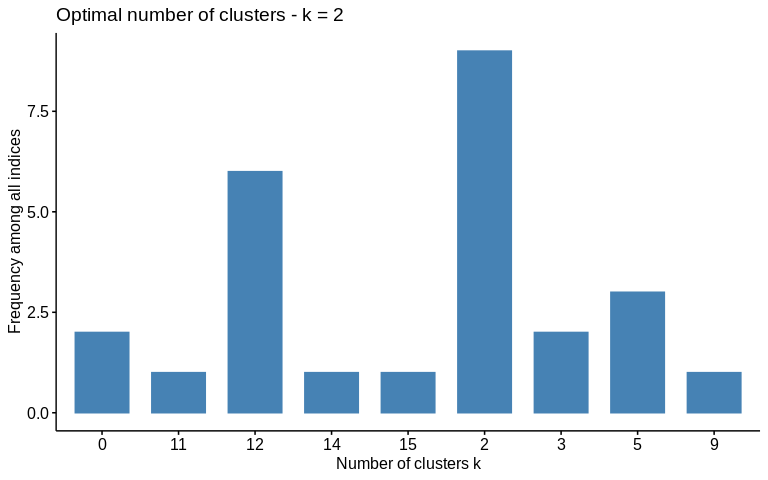<!-- -->

## 

Os resultados dos algoritmos não hierárquicos corroboram para um número de cluster entre 2 a 4. Serão feitos testes com os métodos não hieráquicos utilizando esses número de clusters. O melhor cluster será escolhido com base na proporção de variabilidade entre cluster comparada com a variabilidade total.

## Agrupamento não hierárquico {.tabset}

Os métodos não-hierárquicos da análise de cluster são caracterizados pela necessidade de definir uma partição inicial e pela flexibilidade, uma vez que os elementos podem ser trocados de grupo durante a execução do algoritmo.


### K = 2


```r
df_group <- df_bahia[,-c(1:3)]
kmean <- kmeans(df_group, 2)
perc <-round(kmean$betweenss/kmean$totss*100,2)

df_group$grupo <- factor(kmean$cluster)

ggpairs(df_group,  aes(color = grupo, alpha=0.75), lower=list(continuous="smooth"))  + theme_minimal() + labs(title=paste0("Percentual de variabilidade dentre grupos = ", perc, "%"))
```

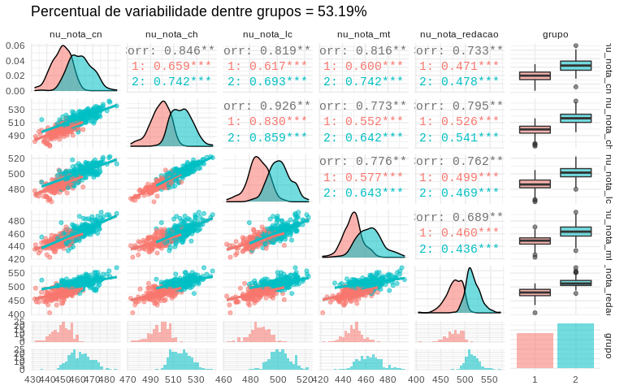<!-- -->

### K = 3 

```r
df_group <- df_bahia[,-c(1:3)]
kmean <- kmeans(df_group, 3)
perc <-round(kmean$betweenss/kmean$totss*100,2)

df_group$grupo <- factor(kmean$cluster)

ggpairs(df_group,  aes(color = grupo, alpha=0.75), lower=list(continuous="smooth"))  + theme_minimal() + labs(title=paste0("Percentual de variabilidade dentre grupos = ", perc, "%"))
```

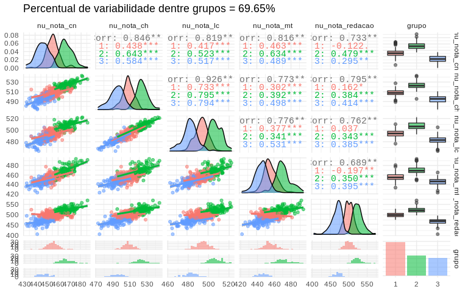<!-- -->

### K = 4


```r
df_group <- df_bahia[,-c(1:3)]
kmean <- kmeans(df_group, 4)
perc <-round(kmean$betweenss/kmean$totss*100,2)

df_group$grupo <- factor(kmean$cluster)

ggpairs(df_group,  aes(color = grupo, alpha=0.75), lower=list(continuous="smooth"))  + theme_minimal() + labs(title=paste0("Percentual de variabilidade dentre grupos = ", perc, "%"))
```

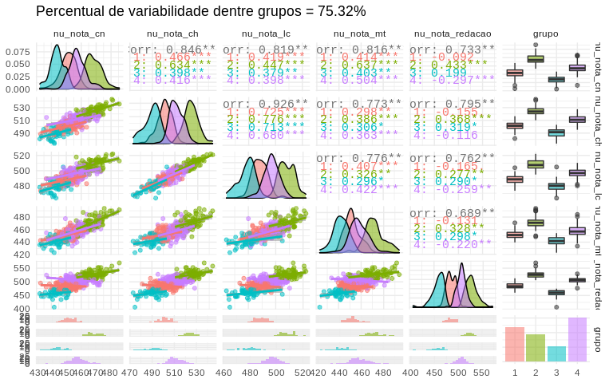<!-- -->

Decidimos selecionar 3 grupos de cluster e podemos interpretá-los como municípios com desempenho baixo, médio e alto.

## Visualizando Resultado

Pra finalizar essa análise, gostaríamos de ver os grupos formados em um mapa pra indentificar possíveis padrões de desempenho em localizações dos municípios da Bahia.


```r
library(sf)

set.seed(09091997)
kmean <- kmeans(df_bahia[,-c(1:3)], 3)

df_bahia$grupo <- factor(kmean$cluster, levels = c(2, 1, 3), labels = c("Baixo", "Médio", "Alto"))

shp_ba <- st_read("data/ba_municipios/29MUE250GC_SIR.shp") %>% 
  mutate(CD_GEOCODM = as.numeric(CD_GEOCODM))
```

```
Reading layer `29MUE250GC_SIR' from data source `/home/gabriela/Github/projetos/presentations/multivariada_ufba/data/ba_municipios/29MUE250GC_SIR.shp' using driver `ESRI Shapefile'
Simple feature collection with 417 features and 3 fields
geometry type:  MULTIPOLYGON
dimension:      XY
bbox:           xmin: -46.6171 ymin: -18.34856 xmax: -37.34115 ymax: -8.532821
proj4string:    +proj=longlat +ellps=GRS80 +no_defs 
```

```r
df_plot <- full_join(shp_ba, df_bahia, by = c("CD_GEOCODM" = "CO_MUNICIPIO_RESIDENCIA"))

ggplot(df_plot, aes(fill = grupo)) + geom_sf(color = "white") + 
  theme_void() +
  scale_fill_manual(values = c("red", "grey", "green")) + 
  labs(fill = "", title = "Agrupamento de acordo com desempenho \n médio na prova do Enem, Municípios da Bahia, 2016") +
    theme(plot.title = element_text(hjust = 0.5))
```

<!-- -->

# 2. Análise Discriminante

A análise discriminante é uma técnica da estatística multivariada utilizada para discriminar e classificar objetos.
Nessa etapa a gente queria ver se conseguiamos separar os municípios de estados diferentes unicamente de acordo com seu desempenho médio. 


```r
df$uf_res <- factor(df$uf_res, levels = c(29, 26),
                    labels = c("Bahia","Pernambuco"))

head(df) %>% kable()
```


| X1| CO_MUNICIPIO_RESIDENCIA|uf_res     | nu_nota_cn| nu_nota_ch| nu_nota_lc| nu_nota_mt| nu_nota_redacao|
|--:|-----------------------:|:----------|----------:|----------:|----------:|----------:|---------------:|
|  1|                 2600054|Pernambuco |   468.2704|   524.8531|   513.9045|   469.7241|        509.8615|
|  2|                 2600104|Pernambuco |   473.2072|   522.2539|   516.6829|   483.7351|        515.9032|
|  3|                 2600203|Pernambuco |   454.7730|   496.4057|   485.9403|   453.0824|        495.7622|
|  4|                 2600302|Pernambuco |   454.9958|   516.3785|   501.3391|   458.7522|        510.3732|
|  5|                 2600401|Pernambuco |   449.6662|   499.8627|   494.8095|   450.7092|        482.6797|
|  6|                 2600500|Pernambuco |   456.1814|   508.0582|   500.8154|   460.2662|        489.9111|


## Descritiva

Veja na Figura abaixo que a Bahia tem mais municípios que Pernambuco e que apesar de o desempenho de Pernambuco ser um pouco maior que o da Bahia, essa diferença não é tão grande.

```r
df %>% 
  select(-X1, -CO_MUNICIPIO_RESIDENCIA) %>%  
ggpairs(aes(color = uf_res, alpha = 0.6), lower=list(continuous="smooth")) + theme_bw() + theme(plot.title=element_text(face='bold',color='black',hjust=0.5,size=12))
```

<!-- -->


## Classificação {.tabset}

Nessa etapa iremos rodar os modelos para tentar discriminar os municípios entre os estados de acordo com sua prova no ENEM.

### Amostra original


```r
library(DiscriMiner)
df_model <- df

modelo <- linDA(df_model$uf_res, variables = df_model[,4:8], prob = T, validation = "crossval")

df_model$predicted <- modelo$classification

sens_lda <- modelo$confusion[1,1]/417
esp_lda <- modelo$confusion[2,2]/185

metrics <- c(taxa_erro = modelo$error_rate, sensibilidade = sens_lda,
  especificidade = esp_lda)

shp_pe <- st_read("data/pe_municipios/26MUE250GC_SIR.shp") %>% 
  mutate(CD_GEOCODM = as.numeric(CD_GEOCODM))
```

```
Reading layer `26MUE250GC_SIR' from data source `/home/gabriela/Github/projetos/presentations/multivariada_ufba/data/pe_municipios/26MUE250GC_SIR.shp' using driver `ESRI Shapefile'
Simple feature collection with 185 features and 3 fields
geometry type:  MULTIPOLYGON
dimension:      XY
bbox:           xmin: -41.35834 ymin: -9.482897 xmax: -32.39091 ymax: -3.828719
proj4string:    +proj=longlat +ellps=GRS80 +no_defs 
```

```r
shp_all <- bind_rows(shp_pe, shp_ba) 
df_plot <- inner_join(shp_all, df_model, by = c("CD_GEOCODM" = "CO_MUNICIPIO_RESIDENCIA"))

ufs <- df_plot %>% 
  group_by(uf_res) %>% 
  summarise(geometry = st_combine(geometry))

ggplot() + 
      geom_sf(
    data = ufs,
    mapping = aes(color = uf_res),
    lwd = 2,
    alpha= 0
    ) +
  geom_sf(
    data = df_plot %>% mutate(error = uf_res == predicted),
    mapping = aes(fill = error),
    color = 'white', lwd = 0.5) +

    scale_fill_manual(values = c("red", "green")) + 
  labs(subtitle = paste0("Acurácia: ", 100*round(1-metrics['taxa_erro'], 3), 
                         " Sensibilidade: ", 100*round(metrics['sensibilidade'], 3), 
                         " Especificidade: ", 100*round(metrics['especificidade'], 3))) +
  theme_void() +
  theme(legend.position = "none")
```

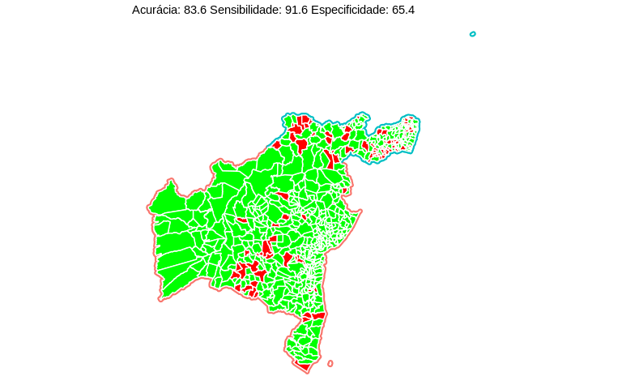<!-- -->

### Amostra balanceada

Aqui vamos balancear as amostras para termos as bases com o mesmo tamanho.


```r
bahia <- df %>% filter(uf_res == "Bahia")
pernambuco <- df %>% filter(uf_res == "Pernambuco")

id <- sample(1:417, 185, replace = F)
bahia <- bahia[id, ]

df_model <- rbind(bahia, pernambuco)

modelo <- linDA(df_model$uf_res, variables = df_model[,4:8], prob = T, validation = "crossval")

df_model$predicted <- modelo$classification

sens_lda <- modelo$confusion[1,1]/185
esp_lda <- modelo$confusion[2,2]/185

metrics <- c(taxa_erro = modelo$error_rate, sensibilidade = sens_lda,
  especificidade = esp_lda)

shp_pe <- st_read("data/pe_municipios/26MUE250GC_SIR.shp") %>% 
  mutate(CD_GEOCODM = as.numeric(CD_GEOCODM))
```

```
Reading layer `26MUE250GC_SIR' from data source `/home/gabriela/Github/projetos/presentations/multivariada_ufba/data/pe_municipios/26MUE250GC_SIR.shp' using driver `ESRI Shapefile'
Simple feature collection with 185 features and 3 fields
geometry type:  MULTIPOLYGON
dimension:      XY
bbox:           xmin: -41.35834 ymin: -9.482897 xmax: -32.39091 ymax: -3.828719
proj4string:    +proj=longlat +ellps=GRS80 +no_defs 
```

```r
shp_all <- bind_rows(shp_pe, shp_ba) 
df_plot <- full_join(shp_all, df_model, by = c("CD_GEOCODM" = "CO_MUNICIPIO_RESIDENCIA"))

ufs <- df_plot %>% 
  group_by(uf_res) %>% 
  summarise(geometry = st_combine(geometry))

ggplot() + 
      geom_sf(
    data = ufs,
    mapping = aes(color = uf_res),
    lwd = 1.5,
    alpha= 0
    ) +
  geom_sf(
    data = df_plot %>% mutate(error = uf_res == predicted),
    mapping = aes(fill = error),
    color = 'white', lwd = 0.5) +

    scale_fill_manual(values = c("red", "green")) + 
  labs(subtitle = paste0("Acurácia: ", 100*round(1-metrics['taxa_erro'], 3), 
                         " Sensibilidade: ", 100*round(metrics['sensibilidade'], 3), 
                         " Especificidade: ", 100*round(metrics['especificidade'], 3))) +
  theme_void() +  theme(legend.position = "none")
```

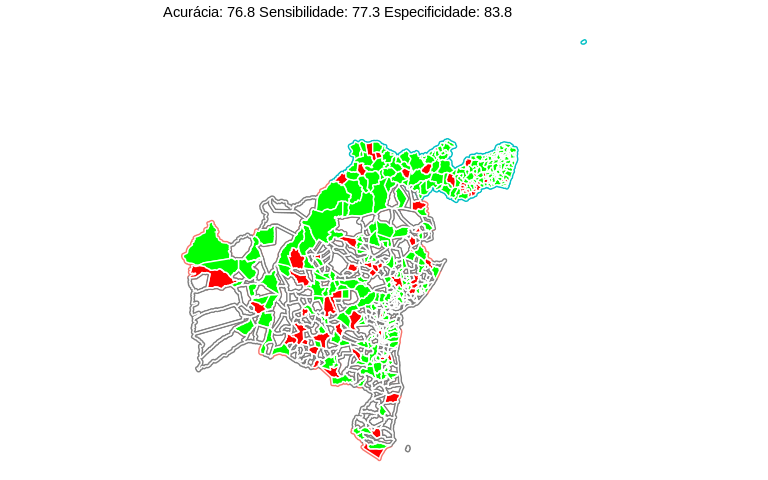<!-- -->


